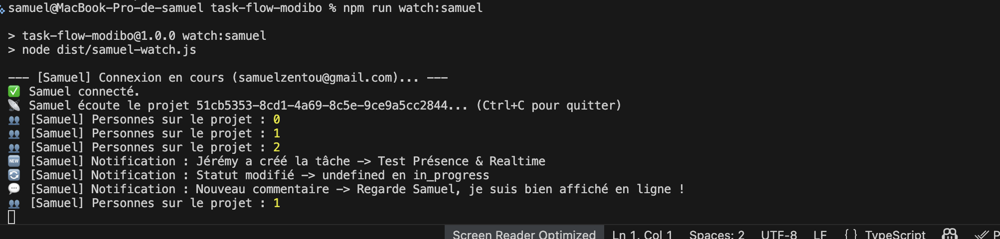
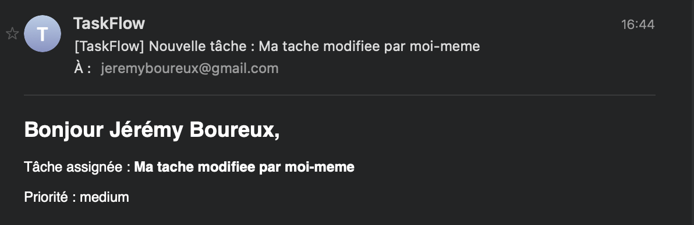
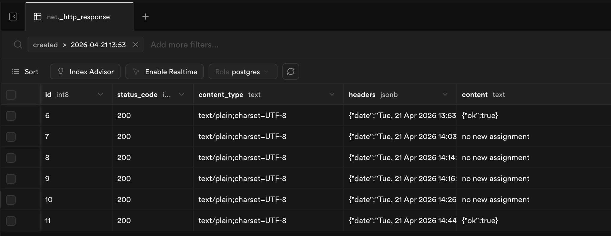
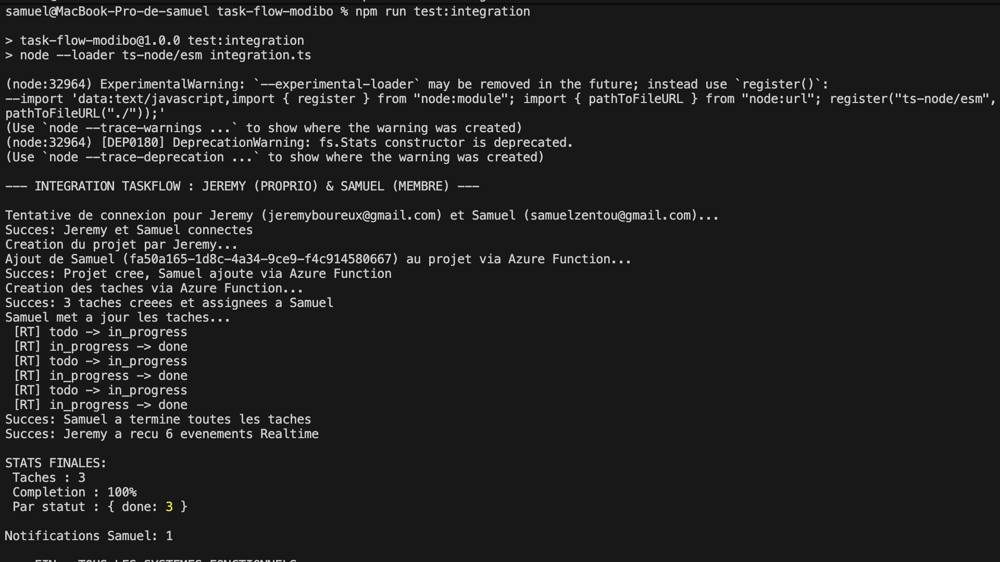

# Journal de Bord - Task-Flow Modibo

## Informations Générales

- **Binôme :** Samuel & jeremy
- **Projet :** Task-Flow (Gestion de tâches avec Supabase & TypeScript)
- **Supabase URL :** `https://mnfnerhjsvdpegjgritr.supabase.co/`

---

## Phase 1 : Refonte et Migration TypeScript

### Ce que nous avons fait

Migration intégrale de JavaScript (CommonJS) vers **TypeScript (ESModules)**.

- **Build :** Sortie dans `./dist`.
- **Imports :** Utilisation des extensions `.js` pour la compatibilité ESM.

---

## Phase 2 : Tests de Sécurité et RLS (Row Level Security)

### Problème : Récursion Infinie

La politique `members_read` créait une boucle infinie. Résolu via une fonction SQL `SECURITY DEFINER`.

**SQL de correction :**

```sql
CREATE OR REPLACE FUNCTION check_project_membership(p_id uuid)
RETURNS boolean AS $$
BEGIN
  RETURN EXISTS (
    SELECT 1 FROM project_members
    WHERE project_id = p_id AND user_id = auth.uid()
  );
END;
$$ LANGUAGE plpgsql SECURITY DEFINER;
```

### Résultats du Script `test-rls.ts`

- **[✅] Test 1 (Accès public) :** 0 tâches reçues (RLS actif).
- **[✅] Test 2 (Insertion anonyme) :** Bloquée par la policy.
- **[✅] Modèle Collaboratif :** Samuel peut modifier la tâche de Jérémy car ils partagent le même projet.

---

## Phase 3 : Intégration Services et Validation Realtime

### 1. Sécurisation des Uploads (UploadThing)

Création de `upload.ts` avec middleware de vérification de session Supabase. Seuls les utilisateurs authentifiés peuvent uploader des fichiers (4MB image / 8MB PDF).

### 2. Gestion Avancée des Tâches

Implémentation de `tasks.ts` :

- `getProjectTasks` : Retourne les tâches avec profils et `comments(count)`.
- `createTask` : Intègre `file_url` et `file_name` pour UploadThing.

### 3. Realtime & Présence (Validation Collaborative)

Mise en place de `realtime.ts` (Channels) et tests croisés avec `samuel-watch.ts` et `jeremy-actions.ts`.

#### Résultats de Validation — Phase 3

- [✅] `getProjectTasks()` retourne les tâches avec profils et comptage de commentaires.
- [✅] Compte Uploadthing configuré (clés dans `.env`).
- [✅] La colonne `file_url` est présente et fonctionnelle dans la table `tasks`.
- [✅] Samuel reçoit en temps réel les créations de Jérémy (< 200ms).
- [✅] Les changements de statut et commentaires arrivent instantanément.
- [✅] La présence affiche les 2 utilisateurs simultanément (`Personnes sur le projet : 2`).

---

### Captures d'écran tests croisés avec `samuel-watch.ts` et `jeremy-actions.ts`




## Phase 4 : Azure Functions, notifications par email:

Pour la mise en place de la fonction Azure, nous avons créé un dossier functions setup avec la stack suivante:

- Typescript
- Docker
- NodeJS 22

Plusieurs diffciultés on été rencontrées et corrigées:

- nom de la fonction en kebab-case (avec des `-`) => Impossible de build le TS car le nom de fonction n'était pas valide => Remplacement des `-` par des `_`
- TP en JS et code en TS => Temps passé a ré-adapter le code en TS
- Fonction non visible sur l'interface d'Azure après déploiement => Il fallait build le TS en JS (remarqué en regardant le fichier `.funcignore`)

### Captures d'écran





### URL AZURE

`https://fn-taskflowmodibo.azurewebsites.net/api/notify_assigned`

## Phase 5: Azure functions, logique métier

Toutes les complications majeures ont été rencontrées lors de la phase précédente, les seules

### URL AZURE

`https://fn-taskflowmodibo.azurewebsites.net/api/manage_members`
`https://fn-taskflowmodibo.azurewebsites.net/api/project_stats`
`https://fn-taskflowmodibo.azurewebsites.net/api/validate_task`

---

## Phase 6 : Intégration Finale et Pipeline Complet

### Script d'intégration `integration.ts`

Nous avons mis en place un script de test de bout en bout qui simule un cycle de projet complet entre **Jérémy** (Propriétaire) et **Samuel** (Membre).

#### Ce que le script valide :
- **Authentification croisée** : Connexion simultanée de deux clients Supabase distincts.
- **Provisioning via Azure** : Création du projet et ajout de membre via l'API Serverless (`manage_members`).
- **Validation Métier** : Création de 3 tâches avec validation de contenu via Azure (`validate_task`).
- **Flux Realtime** : Samuel met à jour les tâches pendant que Jérémy reçoit les notifications de changement de statut en temps réel.
- **Reporting & Notifications** : Calcul des statistiques de fin de projet (`project_stats`) et vérification des notifications reçues par le membre.

#### Résultats de Validation — Phase 6
- [✅] Le script `integration.ts` s'exécute sans erreur de bout en bout.
- [✅] Les Azure Functions répondent avec succès aux requêtes authentifiées.
- [✅] Le pipeline Realtime capte bien les 6 événements attendus (2 transitions par tâche).
- [✅] Les statistiques finales affichent un taux de complétion de 100%.

### Capture d'écran du Test d'Intégration Final



---

## 🔐 État de Validation Final (Projet Terminé)

- [✅] Code 100% TypeScript (Build OK)
- [✅] RLS opérationnel, testé et audité (Sécurité Robuste)
- [✅] Services Backend & Realtime validés à 100%
- [✅] Intégration Serverless Azure Functions complète
- [✅] Pipeline d'intégration finale validé par script
